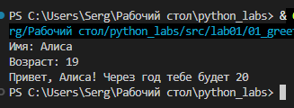
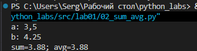
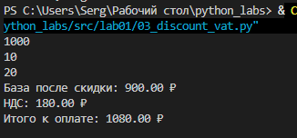
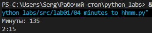
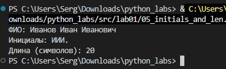
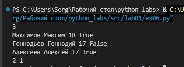
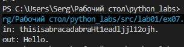

# Лабораторная работа 1

## Задание 1 — Привет и возраст
Запрашивает имя и возраст, выводит через f-строку ответ по шаблону 

[Код: src/01_greeting.py](../../src/lab01.01_greeting.py)

## Задание 2 — Сумма и среднее
Принимает два вещественных числа (с точкой или запятой), выводит сумму и среднее с округлением до 2 знаков после запятой 

[Код: src/02_sum_avg.py](../../src/lab01/02_sum_avg.py)

## Задание 3 — Чек: скидка и НДС
Рассчитывает стоимость после скидки, сумму НДС и итоговую стоимость по введенным данным

[Код: src/03_discount_vat.py](../../src/lab01/03_discount_vat.py)

## Задание 4 — Минуты → ЧЧ:ММ
Переводит целое количество минут в формат часы:минуты

[Код: src/04_minutes_to_hhmm.py](../../src/lab01/04_minutes_to_hhmm.py)

## Задание 5 — Инициалы и длина строки
Из введённого ФИО формирует инициалы в верхнем регистре и выводит длину строки без пробелов

[Код: src/05_initials_and_len.py](../../src/lab01/05_initials_and_len.py)

## Задание 6* — Подсчёт участников
Считывает N записей об участниках и считает количество очных и заочных

[Код: src/06_participants.py](../../src/lab01/06_participants.py)

## Задание 7* — Восстановление строки
Восстанавливает оригинальную строку по заданному алгоритму и зашифрованной строке

[Код: src/07_decode_string.py](../../src/lab01/07_decode_string.py)

