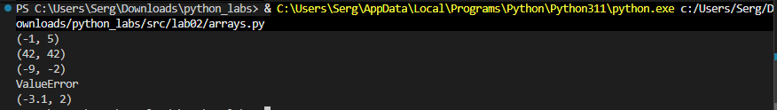
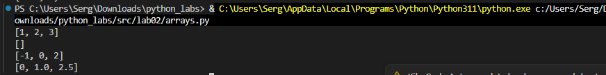
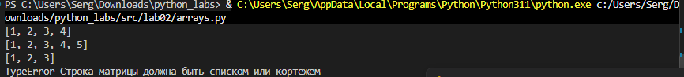
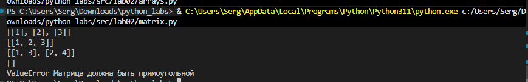
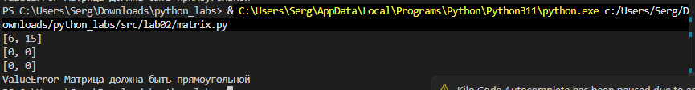

Вот более простой вариант, максимально близкий по стилю к твоей ЛР1:

# Лабораторная работа 2

## Задание 1 — Работа со списками

Реализованы функции для работы со списками: `min_max()` находит минимальный и максимальный элемент без использования `min()` и `max()`, `unique_sorted()` удаляет повторяющиеся элементы и сортирует список без `sort()` и `sorted()`, `flatten()` объединяет вложенные списки и кортежи в один список. Для некорректных данных предусмотрены `ValueError` и `TypeError`.

[Код: src/arrays.py](../../src/lab02/arrays.py)

## Задание 2 — Транспонирование матрицы

Функция `transpose()` меняет строки и столбцы матрицы местами. Перед выполнением проверяется, что все строки имеют одинаковую длину. Для рваной матрицы выводится `ValueError`, пустая матрица возвращается как `[]`.

[Код: src/matrix.py](../../src/lab02/matrix.py)

## Задание 3 — Суммы строк и столбцов

Функции `row_sums()` и `col_sums()` вычисляют суммы элементов каждой строки и каждого столбца матрицы. Для проверки правильности матрицы используется функция `check_matrix()`, которая проверяет одинаковую длину всех строк.

[Код: src/matrix.py](../../src/lab02/matrix.py)

## Задание 4 — Форматирование записи студента

Функция `format_record()` принимает кортеж с ФИО, группой и GPA, убирает лишние пробелы, формирует инициалы и выводит запись в заданном формате. Также проверяет правильность типов данных и значение GPA от 0.0 до 5.0.

[Код: src/tuples.py](../../src/lab02/tuples.py)

## Задание 5 — Проверка ошибочных данных

Проверяется обработка некорректных данных: пустого списка, рваной матрицы и элемента, который не является списком или кортежем. Для обработки ошибок используются `try/except`, поэтому программа выводит только тип ошибки `ValueError` или `TypeError`.

[Код: src/arrays.py](../../src/lab02/arrays.py), [src/matrix.py](../../src/lab02/matrix.py)

