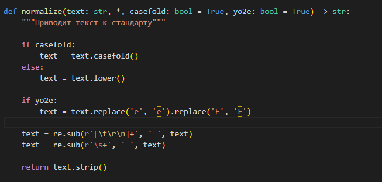
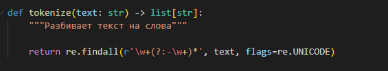
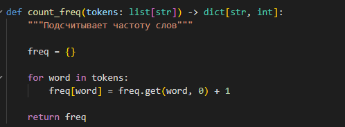
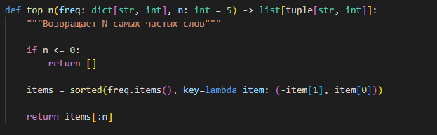
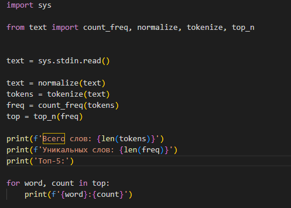
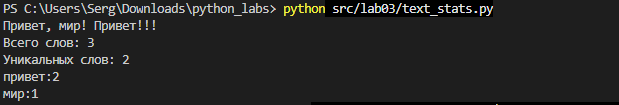

# Лабораторная работа 3

## Задание 1 — Нормализация текста

Реализована функция `normalize()`, которая приводит текст к нижнему регистру, заменяет `ё` на `е`, убирает лишние пробелы и заменяет символы табуляции и переноса строки пробелами. Предусмотрены параметры для управления регистром и заменой `ё` на `е`

[Код: src/lab03/text.py](../../src/lab03/text.py)

## Задание 2 — Разбиение текста на слова

Функция `tokenize()` разбивает текст на отдельные слова с помощью регулярного выражения. Поддерживаются слова с дефисами, числа и символы подчёркивания. Знаки препинания и эмодзи не включаются в результат

[Код: src/lab03/text.py](../../src/lab03/text.py)

## Задание 3 — Подсчёт частоты слов

Функция `count_freq()` подсчитывает количество вхождений каждого слова и сохраняет результат в словаре, где ключом является слово, а значением — количество его повторений

[Код: src/lab03/text.py](../../src/lab03/text.py)

## Задание 4 — Вывод самых частых слов

Функция `top_n()` возвращает список из `N` самых часто встречающихся слов. Слова сортируются по убыванию частоты, а при одинаковой частоте — в алфавитном порядке. Предусмотрена обработка неположительного значения `N`

[Код: src/lab03/text.py](../../src/lab03/text.py)

## Задание 5 — Статистика текста

Скрипт `text_stats.py` считывает текст из стандартного ввода, выполняет нормализацию, разбивает текст на слова и подсчитывает статистику. В результате выводятся общее количество слов, количество уникальных слов и топ-5 самых частых слов с указанием их частоты

[Код: src/lab03/text_stats.py](../../src/lab03/text_stats.py)

## Задание 6 — Проверка работы функций

Проверяется правильность нормализации текст, разбиения на слова, подсчёта частот и сортировки результатов. Отдельно проверяются слова с дефисами, числа, замена `ё` на `е` и алфавитная сортировка слов с одинаковой частотой

[Код: src/lab03/text.py](../../src/lab03/text.py)

